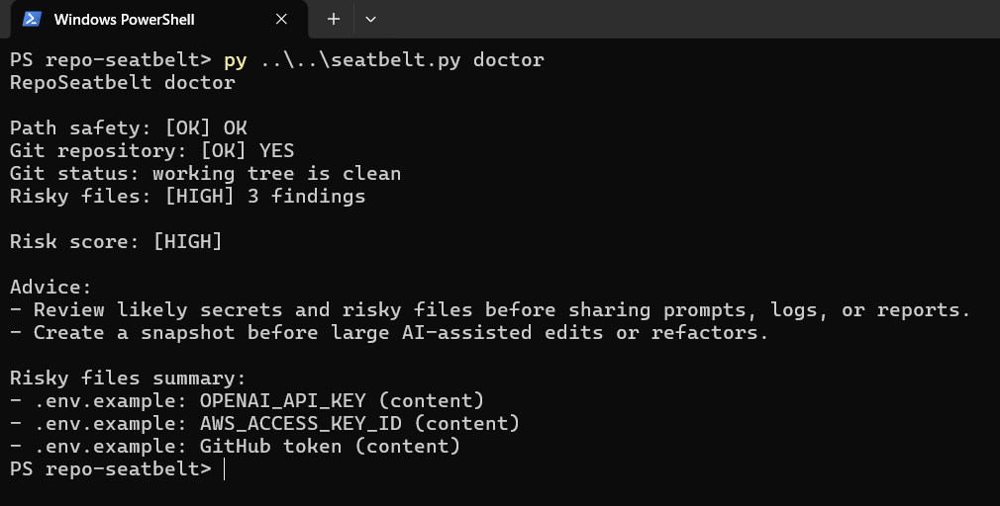

# RepoSeatbelt

**Buckle up before you vibe-code.**

RepoSeatbelt is a Windows-first safety toolkit for AI coding agents like Codex,
Claude Code, Cursor, Gemini CLI, and Copilot.

AI coding agents are fast. Sometimes too fast. RepoSeatbelt gives your project
a local safety check, snapshot, and rule pack before the agent starts editing.

RepoSeatbelt is local-first: no telemetry, no network calls, no background
service, and no global hooks.

## Features

- [x] Risky path detection for drive roots, home, Desktop, Documents, Downloads, temp, and cache roots
- [x] Likely secret detection for common API keys, token names, `.env` files, and private key filenames
- [x] Local project snapshots as timestamped zip files
- [x] Safe restore into a new folder
- [x] AI-agent rule generation for general agents, Codex, Claude Code, and Cursor
- [x] Local report generation
- [x] Optional Claude Code skills
- [x] Windows-first defaults
- [x] No telemetry
- [x] No network calls

## 60-Second Quickstart

```powershell
python -m pip install -e .
seatbelt init
seatbelt doctor
seatbelt snapshot
seatbelt rules --codex --claude --cursor
seatbelt report
```

## Installation

For local development:

```powershell
python -m pip install -e .
```

For tests:

```powershell
python -m pip install -e .[dev]
pytest
```

Future PyPI placeholder:

```powershell
python -m pip install repo-seatbelt
```

## Troubleshooting

If `python -m pip install -e .` fails because your Python environment cannot
load `setuptools.build_meta`, install build dependencies, or reach package
indexes, the CLI can still be tried directly from source.

PowerShell source mode:

```powershell
$env:PYTHONPATH="$PWD\src"
.\.venv\Scripts\python.exe -m repo_seatbelt.cli --help
```

No-install fallback launcher:

```powershell
py seatbelt.py --help
py seatbelt.py doctor
```

This is a local development fallback. The normal install command is still:

```powershell
python -m pip install -e .
```

## CLI Usage

```text
seatbelt init       Create local config, snapshot folder, ignore file, and AGENTS.md
seatbelt doctor     Check path safety, git status, and likely secrets
seatbelt snapshot   Create a timestamped local snapshot
seatbelt restore    List or restore snapshots into a new folder
seatbelt rules      Generate AI-agent safety rule files
seatbelt report     Write .repo-seatbelt/report.md
seatbelt demo       Print a safe guided demo walkthrough
```

Rule targets:

```powershell
seatbelt rules --agents
seatbelt rules --codex
seatbelt rules --claude
seatbelt rules --cursor
seatbelt rules --agents --codex --claude --cursor
```

If no flag is provided, `seatbelt rules` creates `AGENTS.md`.

## Example Output

`seatbelt doctor`:

```text
RepoSeatbelt doctor

Path safety: [OK] OK
Git repository: [OK] YES
Git status: uncommitted changes found
Risky files: [HIGH] 1 finding

Risk score: [HIGH]

Advice:
- Commit or stash current work if you want an easy rollback point.
- Review likely secrets and risky files before sharing prompts, logs, or reports.
- Create a snapshot before large AI-assisted edits or refactors.

Risky files summary:
- .env: .env file (filename)
```

`seatbelt snapshot`:

```text
[OK] Snapshot created: C:\projects\app\.repo-seatbelt\snapshots\repo-seatbelt_20260531_120000.zip
[INFO] Files included: 42
[INFO] Size: 18.4 KB
```

`seatbelt report`:

```text
RepoSeatbelt doctor

Path safety: [OK] OK
Git repository: [OK] YES
Git status: working tree is clean
Risky files: [OK] 0 findings

Risk score: [LOW]

Advice:
- Create a snapshot before large AI-assisted edits or refactors.
Latest snapshot: repo-seatbelt_20260531_120000.zip (18841 bytes)
[OK] Report written: C:\projects\app\.repo-seatbelt\report.md
```

## Why This Exists

AI coding agents can modify files very confidently. That is useful, but it can
also be a little too smooth when a project contains local API keys, uncommitted
work, or lives in a risky folder.

Windows users often keep projects on Desktop or Documents, and local API keys
can sit in project folders for quick experiments. RepoSeatbelt is a lightweight
routine before large AI-assisted changes: check the folder, scan for likely
secrets, write local rules, and make a snapshot.

RepoSeatbelt helps. It does not provide absolute protection.

## Windows-First

RepoSeatbelt prioritizes Windows and PowerShell users. It checks for risky
locations such as `C:\`, drive roots, user home, Desktop, Documents, Downloads,
temp roots, and cache roots. These are common places where a broad file edit or
cleanup command can have a bigger blast radius than intended.

The CLI is cross-platform and uses Python's standard library for core v0.1
behavior.

## What RepoSeatbelt Is

- A local CLI
- A safety checklist
- A snapshot helper
- An AI rule generator
- A lightweight pre-agent workflow

## What RepoSeatbelt Is Not

- A full sandbox
- Antivirus
- A guarantee
- A replacement for Git
- A replacement for real backups
- An enterprise security platform

## Comparison

| Tool | What it helps with | What it does not do |
| --- | --- | --- |
| RepoSeatbelt | Pre-agent checks, snapshots, local reports, AI rules | Full isolation or guaranteed prevention |
| Git | Version history and diffs | Secret awareness or AI-agent rules |
| Secret scanners | Deeper credential detection | Snapshots, restore flow, path checks |
| Command guards | Blocking selected commands | Project reports or agent rules |
| Full sandboxes | Stronger isolation | Lightweight local workflow for every project |

## Who Is This For?

- Vibe coders
- Codex users
- Claude Code users
- Cursor users
- Gemini CLI users
- Windows developers
- Students building projects with AI
- People who keep local API keys in projects
- People who want a simple pre-agent checklist

## Claude Code Skills

RepoSeatbelt includes optional Claude Code skills:

- `/buckle-up`
- `/safe-refactor`
- `/pre-release`

They live in `.claude/skills/` and are optional. The CLI works without Claude
Code.

## Demo GIF Placeholders

- `docs/assets/doctor-demo.gif`
- `docs/assets/snapshot-demo.gif`
- `docs/assets/rules-demo.gif`

## Roadmap

- v0.2 PowerShell installer
- v0.3 local GUI
- v0.4 richer AI rule packs for Codex, Claude Code, and Cursor
- v0.5 local dashboard
- v0.6 optional pre-commit integration
- v0.7 restore diff viewer
- v0.8 packaged Windows executable

## Repository Topics

Suggested GitHub topics:

`ai-coding`, `codex`, `claude-code`, `cursor`, `vibe-coding`,
`developer-tools`, `cli`, `windows`, `ai-safety`, `local-first`,
`agent-tools`

## Contributing

See [CONTRIBUTING.md](CONTRIBUTING.md).

## Security

See [SECURITY.md](SECURITY.md). Please do not include real secrets in issues,
logs, screenshots, or reports.

## License

MIT. See [LICENSE](LICENSE).
